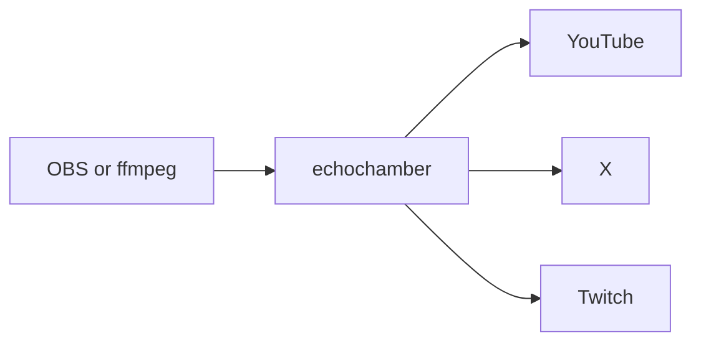

<p align="center">
  
</p>

<h1 align="center">echochamber</h1>

<p align="center">
  Publish once. Show up on YouTube, X, and Twitch.<br>
  When you step away, the room above keeps your place.
</p>

<p align="center">
  <a href="assets/standby.mp4">Play the standby loop</a>
  &nbsp;·&nbsp;
  <a href="LICENSE">MIT</a>
</p>

OBS (or ffmpeg) publishes a single RTMP stream to your machine. echochamber copies it out to every destination you turned on. Stop publishing and those destinations switch to one shared slate. Publish again and the slate is gone.

No accounts are required to try the relay. Keys are only needed when you want a real platform on the other end.

## Run it

You need [Rust](https://rustup.rs) and `ffmpeg` on your `PATH`.

```bash
cargo build --release
./target/release/echochamber init
./target/release/echochamber serve
```

`init` writes `config.toml` in the current directory. Stream keys live there. The file is gitignored, so a later commit will not pick it up.

In OBS:

| | |
|---|---|
| Server | `rtmp://127.0.0.1:1935/echochamber` |
| Stream key | `live` |

Leave `/live` off the server URL. The key belongs in the stream-key field. If a URL does end in `/live`, echochamber still accepts it.

A picture from ffmpeg, with nobody watching yet:

```bash
ffmpeg -re -f lavfi -i testsrc=size=1280x720:rate=30 \
  -f lavfi -i sine=frequency=440:sample_rate=48000 \
  -c:v libx264 -pix_fmt yuv420p -c:a aac -shortest \
  -f flv rtmp://127.0.0.1:1935/echochamber/live
```

Another machine on the LAN can publish too:

```bash
./target/release/echochamber serve --host 0.0.0.0
```

That listens on every interface. The ports stay the ones in `config.toml` (1935 for RTMP, 8080 for control).

## Send it somewhere

Turn a platform on and paste its stream key.

```toml
[platforms.youtube]
enabled = true
stream_key = "YOUR_YOUTUBE_KEY"

[platforms.x]
enabled = true
stream_key = "YOUR_X_KEY"

[platforms.twitch]
enabled = true
stream_key = "YOUR_TWITCH_KEY"
```

- **YouTube** — [YouTube Studio](https://studio.youtube.com) → Go live → Stream key
- **X** — [studio.x.com/producer](https://studio.x.com/producer) → Create Source → RTMP key. After the encoder connects, create a broadcast and go live, or the ingest stays empty on the timeline.
- **Twitch** — [Creator Dashboard → Stream](https://www.twitch.tv/dashboard/settings/stream) → Primary Stream key

Apply it without dropping OBS:

```bash
./target/release/echochamber validate
./target/release/echochamber reload
```

`reload` rereads `config.toml`. Replacing the binary needs `stop`, then `serve` again.

`quality.mode` defaults to `copy`. A 2K picture stays 2K, and each destination gets its own ffmpeg so one platform dying does not take the others down. Set `mode = "reencode"` when you want libx264 (`preset`, `crf`) instead of a straight copy.

One extra destination, without editing the file:

```bash
./target/release/echochamber push --url rtmp://host/app/key
```

## Standby

<p align="center">
  
</p>

The loop in this repo is [`assets/standby.mp4`](assets/standby.mp4), with [`assets/standby.m4a`](assets/standby.m4a) underneath it. While it is on, every destination shares **one** 1080p encode. Three platforms do not mean three encodes.

```toml
[standby]
enabled = true
after_first_publish = true
video = "assets/standby.mp4"
audio = "assets/standby.m4a"
width = 1920
height = 1080
fps = 30
delay_secs = 2
```

`after_first_publish` keeps the slate off until you have been live once. It covers a dropout, not the minutes before the show. `delay_secs` is how long echochamber waits after the publish drops, so a short hitch does not flash the slate. Point `video` and `audio` at your own files to replace the ones shipped here. `audio` may be empty; the picture then goes out in silence.

`reload` picks up a new path or size. `echochamber status` reports it as `ingest.standby`.

## Subtitles

Optional, and off until you turn them on. ffmpeg lifts a few seconds of audio off the local stream, [whisper.cpp](https://github.com/ggml-org/whisper.cpp) writes the words, and cues land in `echochamber_live.srt` and `echochamber_live.ass` beside the process.

```toml
[subtitles]
enabled = true
language = "auto"          # auto | en | ru
whisper_model = "/path/to/ggml-small.bin"
sidecar = true
burn_in = false            # needs ffmpeg built with libass
style = "modern"           # modern | minimal | broadcast
```

Burn-in looks for the `ass` or `subtitles` filter. Homebrew's stock ffmpeg often lacks it. Point `ECHOCHAMBER_FFMPEG_BIN` at a build that has libass, or leave `burn_in` false and use the sidecar files.

## How a frame moves



The ingest is a local RTMP server. Each destination is an ffmpeg process reading that server back. Copy mode remuxes. Standby mode replaces those processes with a single encode of the slate, fanned out to the same places. A new publish tears the slate down and waits until the old processes have released the destination before opening a new one.

## Commands

| Command | What it does |
|---|---|
| `init` | Write a commented `config.toml`. Refuses to overwrite. |
| `validate` | Check the config, ffmpeg, and whisper. `--verbose` prints the ffmpeg arguments with keys masked. |
| `serve` | Run the relay. `--host 0.0.0.0` opens RTMP and control on every interface. |
| `status` | Pretty-printed JSON from the control server. |
| `reload` | Reread `config.toml`. |
| `stop` | Ask the daemon to exit. |
| `push --url` | Add a temporary RTMP destination. |

Config is found in this order: `--config`, `$ECHOCHAMBER_CONFIG`, `./config.toml`, then `~/.config/echochamber/config.toml`.

`status` is the whole story in one document. Rates are bits per second over about a second. `stream_key` is masked.

```json
{
  "ingest": { "publishing": true, "standby": false },
  "pushers": [
    { "name": "youtube", "state": "running", "bps": 8200000 }
  ],
  "bandwidth": { "ingest_bps": 8000000, "push_bps": 8200000 }
}
```

The control server speaks the same thing over HTTP. Default bind is `127.0.0.1:8080`.

| | |
|---|---|
| `GET /status` | Same JSON as `status` |
| `POST /reload` | Same as `reload` |
| `POST /stop` | Same as `stop` |
| `POST /push` | JSON body `{ "url", "name?" }` |

## License

[MIT](LICENSE). The standby picture and loop ship with the repo and you can use them with it.
